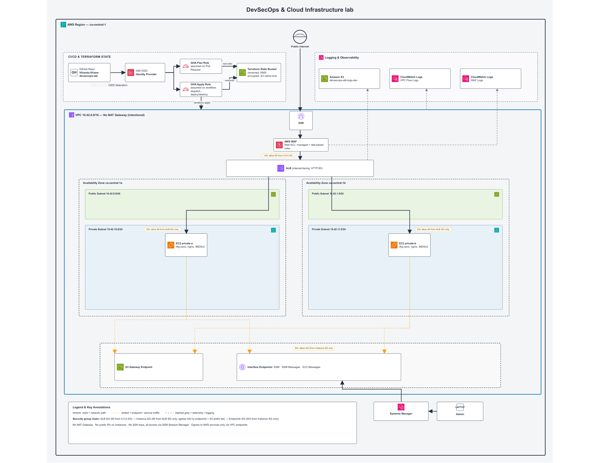

# DevSecOps & Cloud Infrastructure Lab

A multi-AZ AWS infrastructure environment provisioned using modular Terraform, secured with least-privilege network segmentation, and managed via keyless CI/CD automation.

This lab demonstrates a private-by-default network design in AWS that avoids public internet exposure for application workloads. Compute resources reside entirely in private subnets with no attached NAT Gateway and no inbound SSH access. System management, package installation, and AWS service interactions are handled exclusively via VPC Endpoints and Systems Manager (SSM).

---

## Architecture Diagram



---


## AWS Well-Architected Framework Alignment

This architecture applies practices across the pillars of the AWS Well-Architected Framework.

### 1. Security
* **Network Segmentation:** Implements a strict three-tier security group chain where trust relationships are explicit by Security Group ID rather than broad CIDR blocks.
* **Zero Direct Internet Exposure:** EC2 instances reside in private subnets with no route to the internet and no inbound SSH rules. Administrative access is handled exclusively via Systems Manager (SSM) interface endpoints.
* **Identity & Access Management:** Authenticates CI/CD runners using GitHub OIDC federation, eliminating long-lived AWS access keys. Two scoped roles separate read-only plan (pull requests) from apply (main only).
* **Detective Controls:** Centralizes telemetry across VPC Flow Logs, WAF logs (CloudWatch), and ALB access logs (S3).
* **Edge Protection:** Fronts the public ALB with AWS WAF using the Managed Core Rule Set, Known Bad Inputs, and a rate-based rule.
* **Shift-Left Security:** Runs automated Infrastructure as Code security scanning via Checkov on pull requests.
* **Strict Egress Filtering:** Instances are restricted from the general internet (`0.0.0.0/0`) and reach required AWS services only through designated VPC endpoints - interface endpoints by security group reference, the S3 gateway endpoint by prefix list.

### 2. Cost Optimization
* **Designed for Ephemerality:** Infrastructure is fully ephemeral to ensure clean teardowns and eliminate standing costs between testing sessions.
* **Eliminated NAT Gateways:** Removes NAT Gateway hourly charges by routing S3 package retrieval through a no-cost S3 Gateway Endpoint.
* **Controlled Encryption Costs:** The Terraform state bucket uses KMS encryption with S3 Bucket Keys enabled to reduce per-request KMS charges; ephemeral log buckets use default SSE-S3.
* **Native State Locking:** Uses Terraform's native S3 state locking (`use_lockfile`), avoiding a standing DynamoDB table and its associated cost.

### 3. Reliability
* **High Availability:** Distributes compute and load balancing across two Availability Zones (ca-central-1a and ca-central-1b).
* **Redundant Management Path:** Provisions SSM interface endpoints in both Availability Zones so management access survives a single-AZ disruption.
* **Automated Health Monitoring:** Configures ALB health checks to continuously monitor private target instances and route traffic away from degraded compute.

### 4. Operational Excellence
* **Infrastructure as Code:** Provisions the full network, security, compute, and logging stack via modular Terraform with remote S3 state and native S3 state locking.
* **CI/CD Automation:** Executes validation, deployment, and destruction through GitHub Actions, ensuring reproducible builds and eliminating manual configuration drift.
* **Centralized Observability:** Logs flow to CloudWatch and S3 with short retention (1-day) to bound storage cost in an ephemeral lab.

### 5. Performance Efficiency
* **Right-Sized Compute:** Uses Graviton-based `t4g.nano` instances for low-cost, power-efficient performance on lightweight workloads.
* **Optimized Traffic Routing:** Keeps AWS service traffic on the private AWS backbone via VPC Endpoints, reducing reliance on internet routing.

### 6. Sustainability
* **On-Demand Resource Lifecycles:** Runs infrastructure on demand through automated pipelines, so no idle compute consumes energy between active sessions.

---

## GitHub Actions & CI/CD Pipeline

The pipeline uses GitHub Actions with keyless OIDC authentication to AWS - no static credentials are stored. Two scoped IAM roles enforce least privilege: a read-only plan role for pull requests and an apply role restricted to manual deployments from main.

**Pull Request validation** (automatic on every PR):

```
Pull Request ──> OIDC (plan role) ──> Format & Validate ──> Checkov Scan ──> Terraform Plan ──> Plan posted as PR comment
```

**Deployment** (manual trigger via workflow_dispatch):

```
Run workflow ──> OIDC (apply role) ──> Terraform Plan ──> Terraform Apply
```

**Teardown** (manual trigger via workflow_dispatch, typed confirmation required):

```
Run workflow ──> confirm "destroy" ──> OIDC (apply role) ──> Terraform Destroy
```

### Pipeline Features
* **Keyless OIDC Authentication:** Uses OpenID Connect to request temporary, short-lived AWS credentials scoped to the IAM execution role. The apply role's trust policy matches only pushes to `main`; the plan role matches only pull requests.
* **Least-Privilege CI Roles:** Service-scoped apply permissions, with IAM management constrained to the project's `devsecops-lab-*` resource prefix.
* **Automated Security Scanning:** Runs Checkov across all `.tf` files on every pull request.
* **Plan Output in Pull Requests:** Posts `terraform plan` output as a PR comment for review before merge.

---

## Local Development Workflow

To validate, format, and scan the Terraform configuration locally before pushing:

```bash
# 1. Format configuration recursively
terraform fmt -recursive

# 2. Validate syntax
terraform validate

# 3. Run IaC security scan
checkov -d . --framework terraform

# 4. Preview infrastructure changes
terraform plan
```

Provisioning and teardown run through the GitHub Actions workflows above, which authenticate via OIDC and enforce the same least-privilege roles used in CI.

---

## Project Structure

```
bootstrap/              # State bucket, GitHub OIDC provider, scoped CI roles (state)
environments/lab/       # Root configuration wiring the modules together
modules/
  network/              # VPC, subnets, route tables, endpoints, security groups
  compute/              # Private EC2 instances, IAM/SSM, AMI lookup
  alb/                  # Internet-facing ALB, target group, listener
  waf/                  # Regional Web ACL, managed + rate-based rules
  logging/              # ALB access logs (S3), VPC flow logs & WAF logs (CloudWatch)
.github/workflows/      # pr.yml (validate), deploy.yml, destroy.yml
```

---

## Proof of Design

The design choices are verifiable on a running deployment. These three checks demonstrate the core security properties working end to end.

**1. Private compute with no internet route.** From an SSM session on a private instance, package installation succeeds while the open internet is unreachable - proving `dnf` pulls packages solely through the S3 gateway endpoint, not a NAT path.

```bash
# Inside an SSM session on a private instance:
sudo dnf install -y nginx                       # succeeds via S3 gateway endpoint
curl -s -m 10 https://www.google.com            # times out - no internet route
```

**2. WAF blocks OWASP-pattern requests at the edge.** A normal request is served by the private tier; an XSS-pattern request is blocked by the AWS Managed Core Rule Set before it reaches an instance.

```bash
curl -s "http://$ALB"                                    # 200, returns instance hostname
curl -s -o /dev/null -w "%{http_code}\n" \
  "http://$ALB/?q=<script>alert(1)</script>"             # 403, blocked by WAF
```

**3. Telemetry flows to all three destinations.** VPC flow logs and WAF logs land in CloudWatch; ALB access logs land in S3.

```bash
aws logs describe-log-groups --log-group-name-prefix "/aws/vpc/"
aws logs describe-log-groups --log-group-name-prefix "aws-waf-logs-"
aws s3 ls s3://devsecops-lab-alb-logs-<account-id>/ --recursive
```
---